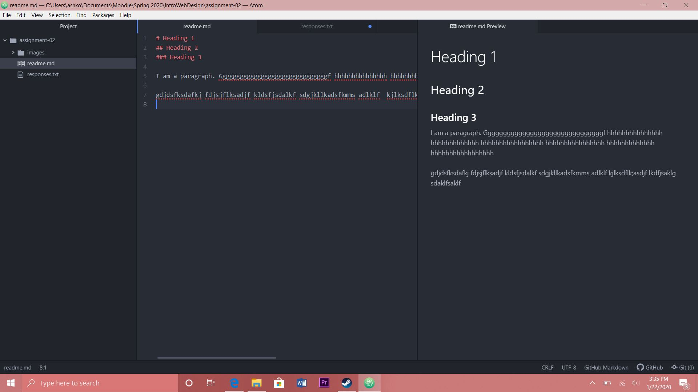

# Assignment 2
## Ashley Koerner

I am taking Web Design because it is required for my major. I think it is also good to learn about web design as I want to be as well rounded as I can in the field of media arts!

3 Things I've learned:

1. I've learned about how the internet works and that it is actually physical
2. I've learned how routers direct around our information
3. I've learned that directories = files

[Youtube](https://www.youtube.com/)

[My Response](./responses.txt)

