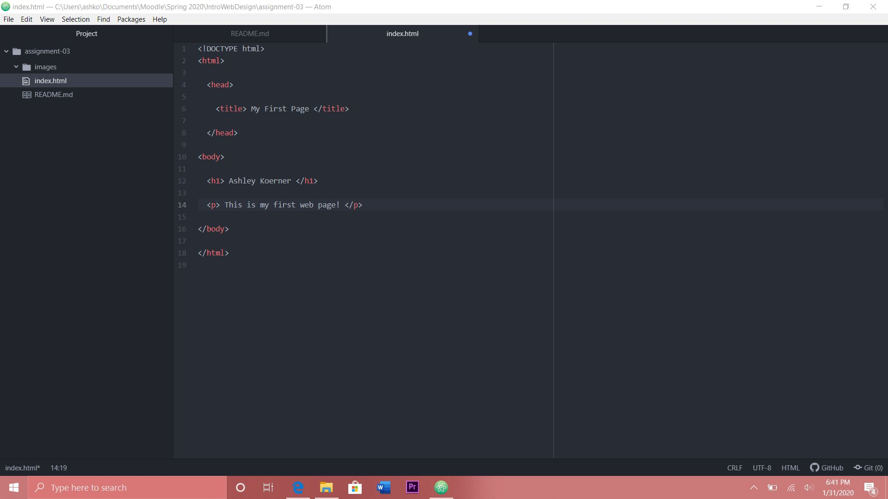

Questions

1.Very briefly detail how browsers function. List any browsers you currently use
to surf - or even develop for - the web.

A browser interprets information given to it by a server that is requested by a
computer. It displays this interpretation using the Rendering Engine. The browser
Engine directs communication between the user interface and the Rendering Engine.
The browser has to connect to a network to it can find the elements needed to show
the page.

I use Microsoft Edge for my browser.

2.What is a markup language? Describe one commonly used in development.

Markup language controls the layout of a page while focusing on text content.
HTML is a common markup language.

