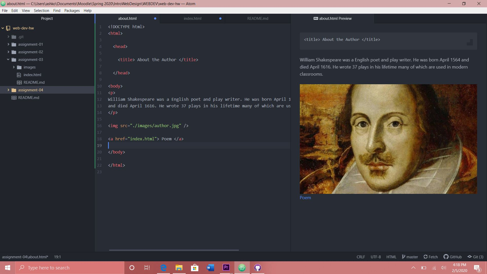

1. I went to Youtube back at the beginning of 2010. It definitely doesn't look as
streamlined as it does now! It looks a website with all the adds all over it an you
would be scared to click anywhere in case you get a virus. Now the icons for videos are bigger
and the tabs are easier to navigate and they have dark mode now which is great.

2. Using GIT was okay. It feels a bit messy and hard to navigate if you aren't paying attention
or are new to it. After awhile I think I began to understand it better and understand why it is important.

