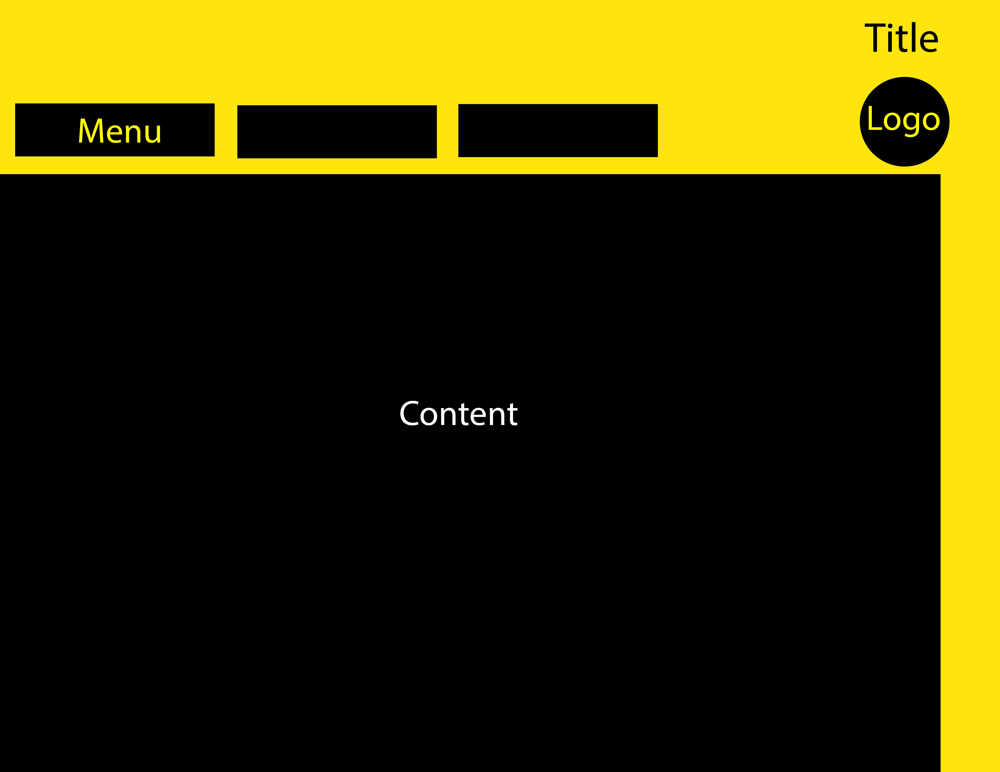

1. Padding is the amount of room between the content and the border.
Border is the line around the outside of the content and padding. The margin is
the room between the border and the next item over.

2. 

3. My work cycle was pretty much the same as last time. I referred to the website
and used a little code from it. I just used a skeleton from a previous assignment and
began filling in the content and code/formatting/etc. to style it and make it work.
It was kind of a challenge to get the display inline stuff to work so I spent a lot
of time on that stuff.
